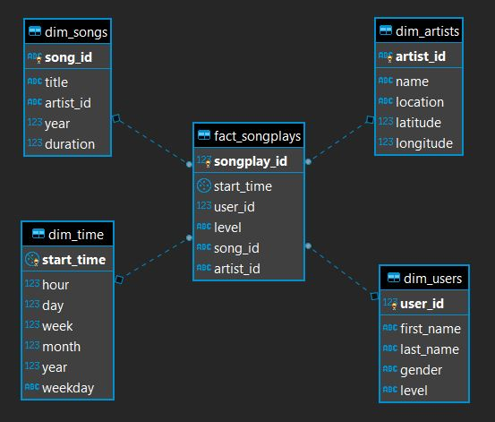

# Project Overview

This folder contains scripts that handle the creation of the `sparkify` database and all of its tables.

 All tables are created in Postgres default schema: `public`. The tables and their relationships are modeled in a `star schema` fashion as shown in the ER Diagram below:

## Data Quality:  

When processing the raw data files, all attributes who are not "ID's" AND have missing values are replaced with the default values below, according to their data types:  

**Decimal Numbers:** replaced by the `9,999,999.99` value  
**Text:** replaced by the `'Unknown'` string  
**Small Integers:** replaced by the `9,999` value  
**Integers:** replaced by the `9,999,999` value  
  
 These default values are set as `CONSTANTS` right at the beginning of the `etl.py` script.  
   
 This makes data quality issues easier to detect and report on, while also avoiding `NULL` entries in Dimensions tables.  
   
> Letting `NULL` entries in Dimension tables is a poor practice, as mentioned in Ralph Kimball's `The Data Warehouse Toolkit` book, page 509. Conversely, `NULL` values are OK in Fact table **metrics** (not in their foreing keys!), as SQL and other analysis tools know how to handle `NULLS` properly when performing calculations upon them.

## Tables used in this project:

#### fact_songplays:
>**Type:** Fact  
**Grain:** one row per song execution event  
**Description:** contains data on users' song execution events and the foreign keys to their corresponding dimensions.  
   
 *Notes* → Referential Integrity is enforced in this table by using Postgres `REFERENCES table(column)` statement right in its `CREATE TABLE` statement: this makes sure that all referenced foreign keys are already present in their corresponding dimension tables.

 #### dim_users:
 > **Type:** Dimension  
 **Grain:** one row per user registered in the platform  
 **Description:** contains users' attributes like names, gender and so forth.

 #### dim_artists:
 >**Type:** Dimension  
 **Grain:** one row per artist registered in the platform  
 **Description:** contains artist's attributes like names, location, etc.  

 #### dim_songs:
 >**Type:** Dimension  
 **Grain:** one row per song registered in the platform  
 **Description:** contains data on Artist's songs like song titles, year of release, duration, etc.

 #### dim_time:
 >**Type:** Dimension  
 **Grain:** one row per distinct song execution timestamp  
 **Description:** contains attributes further describing the date and time of song executions like hour, weekday, month, etc.  

 *Notes* → This table could've been split into two separate dimensions: `date` and `time`. This would reduce its cardinality while also enabling addition of separate attributes further describing song execution dates (like: was it weekend or weekday? Was it holliday season?, etc) and song execution times (like: which time of day was it? Was it "prime-time", etc)

